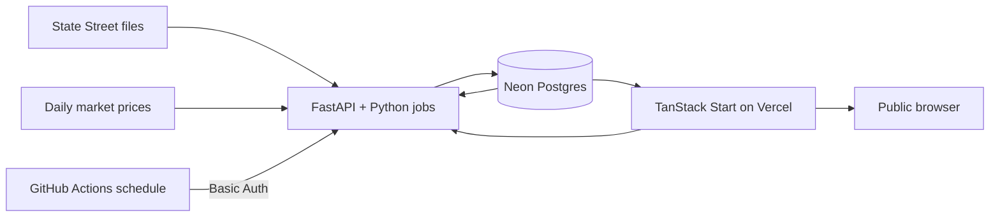

# ETF Sector Flow Monitor — Minimal End-to-End Implementation Plan

**Document status:** Active implementation plan  
**Last updated:** 2026-07-29  
**Primary maintainer:** Point  
**Target:** Public, shareable daily ETF sector-flow website  
**Primary timezone:** Asia/Bangkok  

---

## 0. Mandatory Work-Tracking Rule

This file is the project's implementation source of truth. **Keep the TODO checklist updated as work progresses.**

At the start of each implementation session:

1. Read **Current Status**, **Open Decisions**, and **Work-Tracking TODO List**.
2. Pick the next unblocked task.
3. Mark it as in progress:

```md
- [ ] TASK-ID Description (IN PROGRESS — YYYY-MM-DD)
```

At the end of each implementation session or pull request:

1. Change completed tasks from `- [ ]` to `- [x]`.
2. Remove the `IN PROGRESS` marker from completed tasks.
3. Add newly discovered work to the checklist instead of keeping it only in notes or chat history.
4. Mark blocked work with `(BLOCKED — reason)`.
5. Update **Last updated**, **Current Status**, and **Progress Log**.
6. Move intentionally removed work to **Deferred / Excluded Work** with a short reason.

Keep task tracking lightweight. Do not create separate project-management infrastructure unless this checklist becomes insufficient.

---

## 1. Current Status

**Overall status:** Strategy improvements complete; owner setup pending

**Current milestone:** M4 — production activation; M5 research tooling complete

**Production readiness:** Deployment artifacts verified; accounts, secrets, DNS, backfill, and smoke test pending

### Immediate next actions

- Paper-trade the frozen benchmark-aware candidates before treating results as evidence.
- Complete the owner checklist in `SETUP.md`.
- Migrate Neon and run the initial historical refresh.
- Deploy the analytics container to the VPS and the web app to Vercel.
- Run the production smoke test and manually verify sample flow/backtest periods.
- Implement one complete vertical slice using XLK before processing the full ETF universe.
- Provision the selected VPS deployment target before the production milestone.

---

## 2. Product Goal

Build a simple public website that updates daily and makes sector ETF fund flows easy to inspect and share.

The product should answer:

1. Which sectors are receiving or losing ETF capital?
2. Are those flows persistent, accelerating, or reversing?
3. Which sectors currently rank highest for monthly DCA research?
4. How have simple flow-based sector strategies performed historically?
5. What materially changed after the latest daily update?

The site is a research tool, not an automated trading system and not personalized financial advice.

### Initial ETF universe

| Sector | Ticker |
|---|---:|
| Communication Services | XLC |
| Consumer Discretionary | XLY |
| Consumer Staples | XLP |
| Energy | XLE |
| Financials | XLF |
| Health Care | XLV |
| Industrials | XLI |
| Materials | XLB |
| Real Estate | XLRE |
| Technology | XLK |
| Utilities | XLU |

### MVP scope

The minimal first release includes:

- Historical and daily ingestion for the 11 Select Sector SPDR ETFs.
- Daily flow calculation from changes in shares outstanding and NAV.
- Rankings for 1-day, 5-day, 20-day, 60-day, and 252-day windows.
- Flow values in both USD and percentage of prior AUM.
- A public dashboard, sector-detail pages, methodology page, and backtest page.
- A simple flow score and DCA score.
- Public in-app signal notifications.
- A Basic Auth-protected API for manually or automatically triggering jobs.
- One lightweight Python backtesting implementation.

### Keep the MVP intentionally small

Do not add the following unless a real need appears:

- User accounts or social login.
- Per-user portfolios, alert rules, or notification preferences.
- Email, Telegram, Slack, SMS, or push-notification delivery.
- Redis, Celery, Kafka, Pub/Sub, or another job queue.
- Object storage for downloaded files.
- Microservices beyond the web app and one Python service.
- Intraday data or real-time streaming.
- Automated brokerage execution.
- Complex role-based access control.
- Advanced tracing, APM, or external error-monitoring platforms.

---

## 3. Minimal Architecture

### 3.1 Runtime overview



### 3.2 Components

#### Public web application

Use TanStack Start for the full-stack TypeScript application.

Responsibilities:

- Public server-rendered pages.
- Read-only data queries from Neon through server functions.
- Dashboard visualizations using shadcn/ui and a lightweight chart library.
- Calling FastAPI for backtests or protected operational actions.
- Showing the latest in-app notifications from the database.

Deployment:

- Vercel.
- Vercel Git integration may handle preview and production deployments.
- GitHub Actions still runs quality checks before merge or deployment.

#### Python service

Use a single low-memory FastAPI application for:

- Daily source ingestion.
- Flow and score calculation.
- Backtesting.
- Protected job-trigger endpoints.
- Health checks.

The same Python package may expose CLI commands for local development, but a separate worker service is unnecessary.

Deployment:

- Build one Docker image.
- Initial deployment may be either:
  - the maintainer's VPS using Docker Compose and GitHub Actions; or
  - a Google Cloud Run service.
- Do not run both unless redundancy is intentionally required later.
- Keep the image compatible with Cloud Run by binding to `$PORT` and remaining stateless.

#### Database

Use Neon Postgres for all durable state:

- ETF reference data.
- Daily source values.
- Calculated flows and scores.
- Job history.
- In-app notification events.
- Backtest summaries and results.

No R2, GCS, or other object storage is required. Downloaded spreadsheets are temporary processing inputs and may be deleted after parsing.

---

## 4. Repository Structure

Keep the monorepo small:

```text
etf-sector-flow/
├── apps/
│   └── web/                         # TanStack Start + shadcn/ui
│       ├── src/
│       │   ├── components/
│       │   ├── routes/
│       │   ├── server/
│       │   └── lib/
│       ├── package.json
│       └── vite.config.ts
├── services/
│   └── analytics/                   # FastAPI, ingestion, jobs, backtesting
│       ├── src/sector_flow/
│       │   ├── api.py
│       │   ├── config.py
│       │   ├── db.py
│       │   ├── ingestion.py
│       │   ├── calculations.py
│       │   ├── backtest.py
│       │   └── jobs.py
│       ├── tests/
│       ├── Dockerfile
│       └── pyproject.toml
├── packages/
│   └── db/                          # Drizzle schema and migrations
│       ├── src/schema.ts
│       └── drizzle.config.ts
├── .github/
│   └── workflows/
│       ├── ci.yml
│       ├── deploy-api-vps.yml
│       └── daily-refresh.yml
├── docker-compose.yml
├── bun.lock
├── package.json
└── README.md
```

Avoid creating shared packages until code is genuinely shared. The initial repository may contain only `apps/web`, `services/analytics`, and `packages/db`.

---

## 5. Technology Choices

### TypeScript application

- Runtime and package manager: **Bun**.
- Full-stack framework: TanStack Start.
- UI components: shadcn/ui.
- Styling: Tailwind CSS.
- Tables: TanStack Table where needed.
- Charts: Recharts, Lightweight Charts, or another small React-compatible library. Start with Recharts unless performance becomes a problem.
- Validation: Zod.
- Database schema and migrations: Drizzle ORM and Drizzle Kit.
- Date handling: native `Date`, `Intl`, and a small helper library only if required.

Standard commands:

```bash
bun install
bun run dev
bun run lint
bun run typecheck
bun run test
bun run build
```

Do not add pnpm, npm workspaces, Yarn, Turborepo, or Nx unless Bun workspaces become insufficient.

### Python service

- Python 3.12.
- FastAPI.
- Uvicorn with one worker.
- `uv` for Python dependency management.
- `psycopg` for direct Postgres access.
- `httpx` for downloads.
- `openpyxl` for XLSX parsing.
- NumPy for numerical calculations.
- Pandas or Polars only when they materially simplify backtesting; do not load entire datasets unnecessarily.
- Pytest for tests.

Keep Python database access straightforward. Drizzle owns schema migrations; Python uses SQL queries through `psycopg` rather than maintaining a second ORM model layer.

---

## 6. Data Model

Use a minimal schema. Add tables only when actual requirements demand them.

### `fund`

```text
ticker                 text primary key
name                   text not null
sector                 text not null
source_url             text not null
inception_date         date null
active                  boolean not null default true
created_at              timestamptz not null
updated_at              timestamptz not null
```

### `fund_daily`

Stores both downloaded source values and the calculated daily flow.

```text
ticker                  text not null references fund(ticker)
date                    date not null
nav                     numeric null
shares_outstanding      numeric null
aum                     numeric null
close_price             numeric null
flow_usd                numeric null
flow_pct_aum            numeric null
shares_change           numeric null
source_url              text null
source_hash             text null
retrieved_at            timestamptz not null
quality_status          text not null default 'ok'
quality_note            text null
primary key (ticker, date)
```

### `sector_daily`

Precomputed values used by the public dashboard.

```text
sector                  text not null
date                    date not null
representative_ticker   text not null
flow_1d_usd             numeric null
flow_5d_usd             numeric null
flow_20d_usd            numeric null
flow_60d_usd            numeric null
flow_252d_usd           numeric null
flow_5d_pct_aum         numeric null
flow_20d_pct_aum        numeric null
flow_60d_pct_aum        numeric null
flow_252d_pct_aum       numeric null
positive_flow_days_20d  integer null
relative_return_60d     numeric null
volatility_60d          numeric null
flow_score              numeric null
dca_score               numeric null
state                   text null
rank                     integer null
primary key (sector, date)
```

### `signal_event`

Used only for public in-app notifications.

```text
id                      bigserial primary key
date                    date not null
sector                  text null
type                    text not null
title                   text not null
message                 text not null
severity                text not null default 'info'
created_at              timestamptz not null
```

Examples:

- Technology entered the top three.
- Financials changed from Neutral to Accumulation.
- Energy's 20-day flow changed from positive to negative.
- Source data has not advanced for the expected trading date.

### `job_run`

```text
id                      bigserial primary key
job_type                text not null
status                  text not null
started_at              timestamptz not null
finished_at             timestamptz null
source_date             date null
rows_processed          integer not null default 0
message                 text null
```

Use this table to answer whether the daily refresh succeeded. Do not build a separate admin-monitoring system.

### `backtest_run`

```text
id                      uuid primary key
strategy                 text not null
parameters               jsonb not null
status                   text not null
started_at               timestamptz not null
finished_at              timestamptz null
summary                   jsonb null
monthly_results           jsonb null
error_message             text null
```

For the small expected data volume, storing backtest results as JSONB is simpler than creating several normalized result tables.

### Required indexes

Only add indexes needed by known queries:

```text
fund_daily(date desc)
sector_daily(date desc)
sector_daily(date desc, rank)
signal_event(created_at desc)
job_run(started_at desc)
backtest_run(started_at desc)
```

---

## 7. Data Ingestion and Flow Calculation

### 7.1 Data source workflow

For each ETF:

1. Download the current State Street NAV-history spreadsheet.
2. Parse date, NAV, shares outstanding, and AUM.
3. Normalize column names and number formats.
4. Calculate a source hash.
5. Upsert rows into `fund_daily`.
6. Recalculate the latest affected dates.
7. Delete the temporary downloaded file.

Do not maintain a permanent raw-file archive for the MVP. The database retains the source URL, hash, retrieval time, and normalized source values.

### 7.2 Daily fund-flow formula

```text
daily_flow_usd =
    (shares_outstanding_today - adjusted_shares_outstanding_previous_day)
    × nav_today

flow_pct_aum =
    daily_flow_usd / previous_day_aum
```

Do not use only `AUM_today - AUM_previous_day`; that mixes market-price movement with investor creations and redemptions.

### 7.3 Split handling

Keep split handling simple but explicit:

1. Detect an unusually large inverse change between NAV and shares outstanding.
2. Compare the apparent ratio against common split ratios such as 2:1, 3:1, 4:1, 1:2, and 1:3.
3. Adjust the previous day's shares before calculating flow.
4. Mark uncertain rows with `quality_status = 'review'` and exclude them from scoring until reviewed.

Do not silently treat a suspected split as a large flow.

### 7.4 Validation

Reject or flag rows when:

- Date is missing or duplicated.
- NAV, shares, or AUM is negative.
- Source date moves backwards.
- The same date changes materially between downloads.
- Calculated AUM differs substantially from `NAV × shares outstanding`.
- A flow is extreme enough to indicate a likely parser or split error.

Validation should produce understandable log messages and update `job_run.message`. A full data-quality subsystem is unnecessary.

### 7.5 Daily refresh behavior

The daily job should:

1. Insert a `job_run` row with status `running`.
2. Download and process all 11 ETFs sequentially or with very limited concurrency.
3. Fetch or update daily closing prices.
4. Recalculate recent flows and sector metrics.
5. Generate new `signal_event` rows.
6. Mark the job `succeeded` or `failed`.

The operation must be idempotent. Re-running the same date should update existing rows rather than create duplicates.

No automatic retry framework is required. A failed GitHub Action or manual API call can be rerun manually.

---

## 8. Scores and States

Keep the first scoring model understandable and easy to backtest.

### 8.1 Flow score

Calculate each component as a percentile rank across the 11 sectors for the same date.

```text
Flow Score =
    40% × 20-day flow as % of AUM percentile
  + 30% × 60-day flow as % of AUM percentile
  + 20% × positive-flow-days percentile
  + 10% × 5-day flow acceleration percentile
```

Where:

```text
5-day flow acceleration = current 5-day flow - previous 5-day flow
```

Return a score from 0 to 100.

### 8.2 DCA score

```text
DCA Score =
    60% × Flow Score
  + 30% × 60-day relative-return percentile versus SPY
  + 10% × inverse 60-day volatility percentile
```

This is only a ranking model. It should not be presented as a guaranteed recommendation.

### 8.3 States

Use five deterministic states:

| State | Simple rule |
|---|---|
| Early Rotation | 5-day flow positive, 20-day flow improving, but 60-day flow not yet strongly positive |
| Accumulation | 20-day and 60-day flows positive with Flow Score at least 65 |
| Strong but Crowded | Flow Score at least 85 and price materially extended above its long trend |
| Neutral | No strong positive or negative condition |
| Distribution | 20-day and 60-day flows negative with Flow Score below 35 |

Keep state rules in one Python module and version them in code. Do not make them dynamically configurable in the MVP.

---

## 9. Website Design

The site should be public by default, responsive, fast, and easy to share through normal URLs.

### 9.1 Routes

```text
/                         Main dashboard
/sectors/$ticker          Sector detail
/backtest                 Backtest configuration and results
/methodology              Data sources, formulas, limitations
/api/public/*              Optional public read-only JSON routes
/admin                    Minimal Basic Auth-protected operations page
```

The `/admin` page is optional for the first release. The essential protected operations may remain API-only.

### 9.2 Main dashboard

Show:

- Latest data date and latest job status.
- A prominent but compact in-app notification area.
- Sector ranking table.
- Heatmap for 1D, 5D, 20D, 60D, and 1Y flow as percentage of AUM.
- Toggle between `% of AUM` and USD.
- DCA score, flow score, state, and rank change.
- A simple multi-sector comparison chart.

Default table columns:

```text
Rank
Sector
Ticker
State
1D Flow
5D Flow
20D Flow
60D Flow
Flow Score
DCA Score
Rank Change
```

Use shadcn/ui components such as:

- `Card`
- `Table`
- `Tabs`
- `Badge`
- `Tooltip`
- `Select`
- `Button`
- `Alert`
- `Skeleton`

### 9.3 Sector detail

Show:

- Current rank, state, flow score, and DCA score.
- Daily flow bars.
- Rolling 20-day and 60-day cumulative flow lines.
- ETF price and relative performance versus SPY.
- Historical score and rank.
- Recent signal events for the sector.

Do not create a complicated chart-builder. A small set of fixed, useful charts is sufficient.

### 9.4 Backtest page

Provide a small form:

- Strategy: top 1, top 2 equal weight, top 3 equal weight, or all sectors equal weight.
- Ranking metric: flow score or DCA score.
- Rebalance frequency: monthly only for the MVP.
- Start date.
- Optional transaction cost in basis points.

Show:

- Equity curve.
- CAGR.
- Maximum drawdown.
- Annualized volatility.
- Sharpe ratio.
- Worst 12-month return.
- Comparison against SPY and equal-weight sectors.
- Monthly holdings table.

### 9.5 Methodology page

Explain:

- The data source.
- How ETF flow is reconstructed.
- Why AUM change alone is not used.
- Score formulas.
- Backtest assumptions.
- Data limitations and potential revisions.
- That the output is research, not investment advice.

---

## 10. API Design

Keep the API small.

### 10.1 Public read-only routes

These routes require no authentication:

```text
GET /api/v1/sectors/latest
GET /api/v1/sectors/{ticker}
GET /api/v1/sectors/{ticker}/history?from=&to=
GET /api/v1/notifications/latest
GET /health
```

The TanStack Start app may query Neon directly from server functions for simple reads. Public FastAPI routes are useful for external integrations and should return the same calculated data.

### 10.2 Basic Auth-protected routes

Use HTTP Basic Auth with credentials stored in environment variables:

```text
POST /api/v1/jobs/daily-refresh
POST /api/v1/jobs/recalculate
POST /api/v1/backtests
GET  /api/v1/backtests/{id}
GET  /api/v1/jobs/latest
```

Requirements:

- Use HTTPS in production.
- Compare credentials using constant-time comparison.
- Do not expose credentials to browser-side JavaScript.
- GitHub Actions stores credentials in repository secrets.
- Return `401` with `WWW-Authenticate: Basic` for invalid credentials.

No OAuth, JWT refresh tokens, account database, or user session system is required.

### 10.3 Backtest execution

For the MVP, run backtests synchronously when they complete within the request timeout.

If a backtest becomes too slow:

1. Insert `backtest_run` with status `running`.
2. Start it as an in-process background task.
3. Poll `GET /api/v1/backtests/{id}`.

Do not add Celery or Redis. The dataset is small enough that a simple implementation should be adequate.

---

## 11. In-App Notifications

Notifications are data-driven cards shown inside the website. They are not delivered externally.

### Notification examples

- A sector entered or left the top three.
- A state changed.
- A 20-day flow changed sign.
- A score moved by at least 15 points in one update.
- Source data is stale.
- The latest refresh failed.

### Generation rules

During the daily refresh:

1. Compare the new `sector_daily` rows with the prior available date.
2. Insert only material changes into `signal_event`.
3. Avoid exact duplicates for the same sector, type, and date.
4. Show the latest events on the dashboard.

No delivery queue, retry policy, channel configuration, read receipts, or per-user dismissal state is required.

---

## 12. Backtesting Rules

Backtests must avoid look-ahead bias.

### Required strategies

1. Top one sector by flow score.
2. Top two sectors, equal weighted.
3. Top three sectors, equal weighted.
4. Top three sectors by DCA score, equal weighted.
5. Equal-weight all 11 sectors.
6. SPY buy and hold.

### Timing

- Rank sectors using only data available at the end of the previous trading month.
- Apply the new allocation on the next available trading day.
- Rebalance monthly.
- Use adjusted closing prices or a consistent total-return series.
- Apply transaction costs only at rebalance.

### Outputs

```text
CAGR
maximum drawdown
annualized volatility
Sharpe ratio
Sortino ratio
worst 12-month return
turnover
percentage of months outperforming SPY
monthly holdings
monthly returns
equity curve
```

### Correctness tests

At minimum, test that:

- Future data cannot enter a ranking decision.
- Rebalance dates use the next available trading day.
- Missing sector data does not silently become zero.
- Transaction costs reduce returns correctly.
- Equal weights sum to one.
- Benchmark dates align with strategy dates.

---

## 13. Scheduling

Use GitHub Actions for the daily schedule because it is simple and already part of the infrastructure.

### Daily workflow

A scheduled action calls the protected FastAPI endpoint:

```yaml
name: Daily sector-flow refresh

on:
  schedule:
    - cron: "0 23 * * 1-5" # 06:00 Asia/Bangkok on the following day
  workflow_dispatch:

jobs:
  refresh:
    runs-on: ubuntu-latest
    steps:
      - name: Trigger refresh
        run: |
          curl --fail --silent --show-error \
            --user "${{ secrets.JOB_BASIC_AUTH_USERNAME }}:${{ secrets.JOB_BASIC_AUTH_PASSWORD }}" \
            --request POST \
            "${{ secrets.ANALYTICS_API_URL }}/api/v1/jobs/daily-refresh"
```

There is intentionally no automatic retry. A failed run remains visible in GitHub Actions and can be rerun manually.

The endpoint should return success with a clear `no_new_data` result when the source has not advanced, including weekends and exchange holidays.

---

## 14. Deployment and Infrastructure

### 14.1 Vercel web deployment

Use Vercel for the TanStack Start application.

Recommended setup:

1. Connect the GitHub repository to Vercel.
2. Set the root directory to `apps/web` if required by the selected monorepo configuration.
3. Use Bun for installation and build commands.
4. Configure environment variables in Vercel.
5. Allow Vercel to create preview deployments for pull requests.
6. Deploy production from `main`.

Typical settings:

```text
Install command: bun install --frozen-lockfile
Build command: bun run build
```

### 14.2 VPS deployment for FastAPI

The VPS deployment follows the attached `deploy.yml` pattern but removes unnecessary downtime, unlimited logs, unlimited backups, and repeated no-cache builds.

Suggested workflow:

```yaml
name: Deploy analytics API to VPS

on:
  push:
    branches: [main]
    paths:
      - "services/analytics/**"
      - "docker-compose.yml"
      - ".github/workflows/deploy-api-vps.yml"
  workflow_dispatch:

concurrency:
  group: deploy-analytics-vps
  cancel-in-progress: false

jobs:
  deploy:
    runs-on: ubuntu-latest
    steps:
      - name: Deploy through SSH
        uses: appleboy/ssh-action@v1.0.0
        with:
          host: ${{ secrets.VPS_HOST }}
          username: ${{ secrets.VPS_USERNAME }}
          key: ${{ secrets.VPS_SSH_KEY }}
          passphrase: ${{ secrets.VPS_SSH_KEY_PASSPHRASE }}
          script_stop: true
          script: |
            set -e

            cd ~/projects/etf-sector-flow

            git fetch origin main
            git reset --hard origin/main

            docker compose build analytics
            docker compose up -d --remove-orphans analytics

            echo "=== Analytics logs ==="
            docker compose logs --tail=100 analytics

            timeout=45
            elapsed=0
            until curl --fail --silent http://localhost:8000/health > /dev/null; do
              if [ "$elapsed" -ge "$timeout" ]; then
                echo "Health check failed"
                docker compose logs --tail=200 analytics
                exit 1
              fi
              sleep 2
              elapsed=$((elapsed + 2))
            done

            docker image prune -f
            docker builder prune -f --filter "until=168h"

            echo "Deployment successful"
```

Do not use `docker compose build --no-cache` on every deployment. It wastes time and disk space on a small VPS.

### 14.3 Docker Compose and log limits

Configure Docker's built-in log rotation so logs cannot grow without limit:

```yaml
services:
  analytics:
    build:
      context: ./services/analytics
    restart: unless-stopped
    env_file:
      - ./services/analytics/.env
    ports:
      - "127.0.0.1:8000:8000"
    command: >
      sh -c 'uvicorn sector_flow.api:app
      --host 0.0.0.0
      --port 8000
      --workers 1
      --limit-concurrency 10'
    mem_limit: 512m
    logging:
      driver: json-file
      options:
        max-size: "10m"
        max-file: "3"
    healthcheck:
      test: ["CMD", "curl", "-f", "http://localhost:8000/health"]
      interval: 30s
      timeout: 5s
      retries: 3
      start_period: 10s
```

This caps the service's local Docker logs at approximately 30 MB. View them with:

```bash
docker compose logs --tail=200 analytics
docker compose logs -f analytics
```

The deployment workflow prunes unused images and old builder cache. Do not automatically prune active volumes.

### 14.4 Reverse proxy

Use the VPS's existing reverse proxy if available. Otherwise use a minimal Caddy or Nginx configuration to:

- Terminate HTTPS.
- Proxy a dedicated API hostname to `127.0.0.1:8000`.
- Reject plain HTTP or redirect it to HTTPS.
- Optionally add a conservative request-body limit.

Do not expose port 8000 publicly.

### 14.5 Google Cloud Run service alternative

The same Docker image should be deployable to Google Cloud Run without code changes.

Use Cloud Run instead of the VPS when simpler operations or scale-to-zero are preferable:

- Service type: Cloud Run service.
- CPU: 1.
- Memory: 512 MiB initially.
- Minimum instances: 0.
- Maximum instances: 1 initially.
- Concurrency: 10.
- Request timeout: long enough for the daily refresh and expected backtests.
- Environment variable `PORT` must control the listening port.

When Cloud Run is selected:

- Disable the VPS deployment workflow.
- Point Vercel and the scheduled GitHub Action to the Cloud Run URL.
- Protect operational routes with the same Basic Auth.
- Do not maintain both deployments unless there is a specific reason.

### 14.6 Environment variables

#### Web

```text
DATABASE_URL
ANALYTICS_API_URL
ANALYTICS_BASIC_AUTH_USERNAME
ANALYTICS_BASIC_AUTH_PASSWORD
```

The Basic Auth credentials are available only to TanStack server functions and must never be prefixed as public browser variables.

#### Python service

```text
DATABASE_URL
BASIC_AUTH_USERNAME
BASIC_AUTH_PASSWORD
APP_ENV
LOG_LEVEL
ALLOWED_ORIGINS
PORT
```

Keep secrets in Vercel, GitHub Actions, the VPS `.env`, or Cloud Run environment configuration. Never commit them.

---

## 15. Low-Memory FastAPI Requirements

The data universe is small, so the Python service should remain lightweight.

Requirements:

- Use `python:3.12-slim` or an equivalent small base image.
- Run one Uvicorn worker.
- Limit request concurrency.
- Process ETF files one at a time or with at most two concurrent downloads.
- Stream downloads to a temporary file rather than holding large binary files in memory.
- Read only required spreadsheet columns.
- Query only the date range required for each calculation.
- Avoid loading the full database into a DataFrame.
- Reuse one small Postgres connection pool.
- Return paginated or downsampled chart data where appropriate.
- Set a 512 MB container memory limit initially and reduce it after observing real usage.

Suggested Dockerfile shape:

```dockerfile
FROM python:3.12-slim

ENV PYTHONDONTWRITEBYTECODE=1 \
    PYTHONUNBUFFERED=1 \
    PORT=8000

WORKDIR /app

RUN pip install --no-cache-dir uv

COPY pyproject.toml uv.lock ./
RUN uv sync --frozen --no-dev

COPY src ./src

ENV PATH="/app/.venv/bin:$PATH" \
    PYTHONPATH="/app/src"

CMD ["sh", "-c", "uvicorn sector_flow.api:app --host 0.0.0.0 --port ${PORT} --workers 1 --limit-concurrency 10"]
```

Do not add Gunicorn, several workers, or a separate process supervisor unless a demonstrated issue requires them.

---

## 16. CI and Quality Checks

### Pull-request CI

Use one GitHub Actions workflow:

```yaml
name: CI

on:
  pull_request:
  push:
    branches: [main]

jobs:
  web:
    runs-on: ubuntu-latest
    steps:
      - uses: actions/checkout@v4
      - uses: oven-sh/setup-bun@v2
      - run: bun install --frozen-lockfile
      - run: bun run lint
      - run: bun run typecheck
      - run: bun run test
      - run: bun run build

  analytics:
    runs-on: ubuntu-latest
    steps:
      - uses: actions/checkout@v4
      - uses: astral-sh/setup-uv@v5
      - working-directory: services/analytics
        run: uv sync --frozen
      - working-directory: services/analytics
        run: uv run pytest
```

Keep CI focused on checks that catch real breakages. Do not add large security scanners, performance suites, or multi-environment matrices during the MVP.

### Minimum tests

- Flow formula unit tests.
- Split-adjustment tests.
- Parser fixture for one real spreadsheet structure.
- Idempotent upsert test.
- Score calculation test.
- Look-ahead-bias backtest test.
- One web data-loader test.
- One dashboard rendering smoke test.

---

## 17. Minimal Observability and Operations

No dedicated monitoring platform is required.

### Logs

- FastAPI logs to stdout and stderr.
- Use readable structured text or compact JSON, but keep fields limited.
- Include timestamp, level, request path or job name, duration, status, and error message.
- Never log database credentials or Basic Auth headers.
- Docker log rotation caps disk use.
- Vercel logs are used for the web app.
- GitHub Actions logs are used for deployment and scheduled-job visibility.

### Health and status

Provide:

```text
GET /health
```

Response:

```json
{
  "status": "ok",
  "database": "ok"
}
```

The dashboard should also show:

- Latest source date.
- Latest successful refresh time.
- Latest job status.

This is enough for a solo-maintained MVP.

### Manual operational commands

```bash
# Follow API logs
docker compose logs -f analytics

# Show recent API logs
docker compose logs --tail=200 analytics

# Restart the service
docker compose restart analytics

# Inspect container state
docker compose ps

# Trigger a refresh manually
curl --user "$USER:$PASSWORD" -X POST \
  https://api.example.com/api/v1/jobs/daily-refresh

# View Docker disk usage
docker system df

# Remove unused images only
docker image prune -f
```

Do not create a large operations runbook. Add a command here only after it has been needed in practice.

---

## 18. Work-Tracking TODO List

Keep this section updated throughout implementation.

### M0 — Repository and source validation

- [x] M0-01 Create the Bun workspace and root scripts.
- [x] M0-02 Create the TanStack Start application.
- [x] M0-03 Install and configure Tailwind CSS and shadcn/ui.
- [x] M0-04 Create the FastAPI project with `uv` and a `/health` route.
- [x] M0-05 Create the Drizzle package and Neon connection configuration.
- [x] M0-06 Inspect State Street historical files for all 11 ETFs.
- [x] M0-07 Save one representative parser fixture without committing prohibited source data.
- [x] M0-08 Confirm Twelve Data `time_series?adjust=all` for ETF and SPY adjusted prices.
- [x] M0-09 Select VPS as the initial Python deployment target.
- [ ] M0-10 Verify the Neon connection (BLOCKED — requires `DATABASE_URL`).

**M0 acceptance:** Both applications run locally, Neon is reachable, and the required State Street fields are confirmed.

### M1 — Data pipeline and calculations

- [x] M1-01 Add Drizzle migrations for `fund`, `fund_daily`, `sector_daily`, `signal_event`, `job_run`, and `backtest_run`.
- [x] M1-02 Seed the 11 ETF records (plus inactive SPY benchmark reference).
- [x] M1-03 Implement the State Street downloader.
- [x] M1-04 Implement XLSX parsing for one ETF.
- [x] M1-05 Implement idempotent `fund_daily` upserts.
- [x] M1-06 Implement daily flow and flow-as-%-of-AUM calculations.
- [x] M1-07 Implement basic split detection and quality flags.
- [ ] M1-08 Complete the XLK vertical slice from download to database (BLOCKED — requires `DATABASE_URL` and `TWELVE_DATA_API_KEY`).
- [x] M1-09 Extend ingestion to all 11 ETFs.
- [x] M1-10 Add daily ETF and SPY price ingestion using Twelve Data adjusted prices.
- [x] M1-11 Implement rolling flow metrics.
- [x] M1-12 Implement Flow Score, DCA Score, states, and ranks.
- [x] M1-13 Implement idempotent `signal_event` generation.
- [x] M1-14 Implement the full daily refresh job.
- [x] M1-15 Add calculation, parser, and idempotency tests.

**M1 acceptance:** A single command or API call refreshes all 11 sectors and produces valid dashboard-ready rows.

### M2 — Public website

- [x] M2-01 Implement the public dashboard server loader.
- [x] M2-02 Build the ranking table.
- [x] M2-03 Build the flow heatmap.
- [x] M2-04 Build the dashboard notification cards.
- [x] M2-05 Build sector-detail routes and fixed useful charts.
- [x] M2-06 Add URL-shareable period and metric query parameters.
- [x] M2-07 Build the methodology page.
- [x] M2-08 Add loading, empty, stale-job, error, and not-found states.
- [x] M2-09 Verify responsive 1440px desktop and 500px compact layouts in headless Chrome.
- [x] M2-10 Add basic SEO and social metadata for shareable pages.

**M2 acceptance:** Anyone with the URL can inspect current and historical flows without signing in.

### M3 — API and backtesting

- [x] M3-01 Implement public sector-data API routes.
- [x] M3-02 Add FastAPI HTTP Basic Auth helper with constant-time comparisons.
- [x] M3-03 Implement the protected daily-refresh and recalculate routes.
- [x] M3-04 Implement the protected job-status route.
- [x] M3-05 Implement the monthly backtest engine.
- [x] M3-06 Add top-one/two/three, DCA/flow, equal-weight, and SPY comparison strategies.
- [x] M3-07 Add transaction-cost support.
- [x] M3-08 Add look-ahead-bias, next-trading-day, missing-data, weight, cost, and alignment tests.
- [x] M3-09 Implement protected synchronous backtest API routes and persisted results.
- [x] M3-10 Build the backtest form, summary, equity charts, and monthly holdings table.

**M3 acceptance:** The public site shows current data, and a protected API call can run a reproducible monthly backtest.

### M4 — Deployment and release

- [x] M4-01 Create the CI workflow using Bun and `uv`.
- [x] M4-02 Create the production FastAPI Dockerfile.
- [x] M4-03 Create and validate `docker-compose.yml` with 512 MB memory, loopback port, health, and 30 MB log limits.
- [x] M4-04 Add the VPS SSH deployment workflow with health check and bounded image/cache pruning.
- [ ] M4-05 Configure VPS HTTPS and reverse proxy (BLOCKED — requires VPS and API domain; Caddy example provided).
- [x] M4-06 Exclude Cloud Run because VPS is the selected single target.
- [ ] M4-07 Configure Vercel and production environment variables (BLOCKED — requires Vercel project and secrets).
- [x] M4-08 Add the GitHub Actions daily-refresh workflow.
- [ ] M4-09 Verify deployed Docker log growth and pruning (BLOCKED — Compose limits validated locally; requires running VPS).
- [ ] M4-10 Run historical backfill (BLOCKED — requires Neon and Twelve Data credentials).
- [ ] M4-11 Perform a production smoke test (BLOCKED — requires deployed domains).
- [x] M4-12 Publish the methodology and limitations.

**M4 acceptance:** The website is public, the daily job runs, API logs are bounded on disk, and the full system can be operated by one maintainer.

### M5 — Benchmark-aware strategy research

- [x] M5-01 Enforce a 252-trading-day backtest warm-up and configurable execution lag.
- [x] M5-02 Report complete SPY, excess-return, tracking-error, and information-ratio metrics.
- [x] M5-03 Add a monthly top-three trailing-12-month sector-momentum strategy.
- [x] M5-04 Add SPY-core variants for flow-ranked and momentum-ranked active sleeves.
- [x] M5-05 Add standardized flow-surprise confirmation and confidence gating.
- [x] M5-06 Expose the new strategies, assumptions, and metrics in the web application.
- [x] M5-07 Add unit and integration coverage for timing, selection, weights, and reporting.

**M5 acceptance:** The strategy lab can compare flow and momentum challengers against SPY using explicit timing assumptions and benchmark-relative risk metrics.

---

## 19. Definition of Done

The MVP is done when:

- All 11 sector ETFs have a historical daily dataset.
- Daily flow uses shares-outstanding changes and NAV.
- Suspected splits and malformed rows are not silently accepted.
- The dashboard displays current flow rankings and score states.
- Each sector has a shareable detail page.
- The latest material changes appear as in-app notifications.
- Public read-only functionality requires no login.
- Operational and backtest endpoints use HTTP Basic Auth.
- Monthly backtests avoid look-ahead bias and compare against SPY.
- The web app is deployed on Vercel.
- The Python container runs on either the VPS or Cloud Run, not unnecessarily on both.
- The daily refresh is triggered by GitHub Actions.
- Docker logs are rotated and capped when deployed to the VPS.
- The TODO list and methodology documentation are current.

---

## 20. Open Decisions

Resolve these only when they block implementation:

- [x] Use Twelve Data `time_series` with `adjust=all` for ETF and SPY backtests.
- [x] Use the VPS as the initial Python deployment target.
- [ ] What public domain names will be used for the web app and API?
- [ ] Is State Street data usage acceptable for the intended public presentation of derived metrics?
- [x] The common source-data start date is 2018-06-18, limited by XLC.

Do not introduce additional architecture work merely to keep both deployment options active.

---

## 21. Deferred / Excluded Work

The following are intentionally outside the MVP:

- Per-user authentication and profiles.
- Personalized alerts or portfolios.
- External notification delivery.
- Delivery retries.
- Object storage.
- Message queues and distributed workers.
- Sentry, OpenTelemetry, APM, and managed log aggregation.
- Cloudflare deployment.
- Intraday ingestion.
- Multiple ETF issuers per sector.
- Google Cloud Run deployment (VPS selected as the single initial target).
- Automated trading.
- Complicated admin dashboards.
- Multi-region or highly available deployment.

Reintroduce an item only when a concrete requirement justifies its maintenance cost.

---

## 22. Progress Log

Add one concise entry after each meaningful implementation session.

```text
2026-07-28 — Replaced the original over-engineered plan with a minimal architecture using Bun, TanStack Start, Neon, one FastAPI service, Vercel, GitHub Actions, and a VPS-or-Cloud-Run deployment choice.
2026-07-28 — Initialized Git and the Bun monorepo; scaffolded TanStack Start, Tailwind/shadcn, FastAPI, and Drizzle; validated the four required NAV-history columns across all 11 State Street files; selected Twelve Data adjusted prices and VPS deployment.
2026-07-28 — Added the six-table Drizzle migration, fund seeding, streaming State Street/Twelve Data ingestion, flow and split calculations, rolling scores/states/ranks, notifications, and an idempotent daily job; eight analytics tests pass. Live database validation remains credential-blocked.
2026-07-28 — Built the editorial public dashboard, ranking table with rank change, horizon heatmap, signals, shareable sector histories, fixed charts, methodology, responsive states, and metadata; verified typecheck, lint, render smoke test, production build, and desktop/compact browser layouts.
2026-07-28 — Added public data routes, constant-time Basic Auth for operational routes, synchronous persisted monthly backtests, baseline/SPY comparisons, transaction costs, a server-mediated backtest UI, and seven new auth/backtest tests; confirmed server credentials do not appear in the client bundle.
2026-07-28 — Added Nitro/Vercel output, FastAPI container/Compose, CI, VPS deploy, daily schedule, Caddy example, and the owner setup checklist. Validated Compose memory/log/port settings and all 11 live workbook shapes; fixed disclosure/footer parsing and unavailable pre-2006 values. Docker Hub did not complete the base-image pull locally, so the image build remains a production/setup verification item.
2026-07-28 — Began M5 strategy research implementation: enforced a 252-trading-day warm-up, added configurable execution delay, retained pre-start-date history, and added complete SPY-relative performance and risk metrics with tests.
2026-07-28 — Completed M5 benchmark-aware research tools: added top-three 12-month momentum, 70/30 SPY-core flow and momentum sleeves, standardized flow confirmation with SPY fallback, and exposed exact assumptions, allocations, and benchmark-relative metrics in the strategy lab.
2026-07-28 — Verified all four M5 strategies end to end against 85 monthly periods in the configured database, then passed 30 analytics tests, five web tests, lint, typecheck, and the production build.
2026-07-29 — Moved the weekday data refresh to 23:00 UTC Monday–Friday, corresponding to 06:00 Asia/Bangkok Tuesday–Saturday after each US trading session.
```
